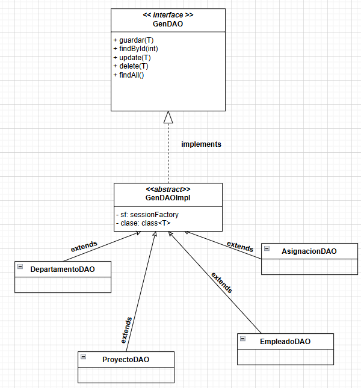

# M06-UF4-A01

# Pregunta 1
El patrón DAO se encarga de separar la lógica de acceso a datos del resto de la aplicación. Abstrae y encapsula todas las operaciones CRUD. En mi caso, he implementado esta lógica en las clases DepartamentoDAO, EmpleadoDAO, ProyectoDAO y AsignacionDAO, donde cada una gestiona las operaciones para su entidad correspondiente.

# Pregunta 2
Considero que el patrón DAO es útil porque centraliza y organiza el acceso a los datos, lo que hace que el código sea más limpio, mantenible y fácil de entender. 

En mi caso, me ha servido para:

- Evitar la duplicación de código: Al tener métodos comunes como save, get, update y delete en la clase abstracta GenDAOImpl, no he tenido que repetir la lógica de acceso a datos en cada DAO.

- Mejorar la legibilidad: Al separar la lógica de acceso a datos, el código del Main y otras partes de la aplicación es más claro y se enfoca en la lógica de negocio, no en cómo se almacenan o recuperan los datos.

# Pregunta 3
Sí, he tenido que hacer algunos ajustes en el código de la aplicación, especialmente en el Main, para adaptarlo al uso del patrón DAO. Los cambios principales han sido:

Cambio de EntityManager a SessionFactory:

Originalmente, el Main utilizaba EntityManager para interactuar con la base de datos. Sin embargo, al implementar el patrón DAO, cambié a SessionFactory porque es más compatible con Hibernate y permite una mejor gestión de las transacciones. Esto ha hecho que tenga que modificar la inicialización de los DAOs en el Main para pasarles el SessionFactory en lugar del EntityManager.

Manejo de transacciones:

Antes, el Main gestionaba manualmente las transacciones con entityManager.getTransaction().begin() y entityManager.getTransaction().commit(). Con el patrón DAO, esta responsabilidad la he movido a las clases DAO, lo que ha simplificado el código del Main.

# Pregunta 4
.

# Pregunta 5
La clase abstracta (GenDAOImpl) es fundamental en el patrón DAO porque centraliza la lógica común (CRUD, transacciones) y evita duplicar código. No es 100% necesaria, pero es muy útil cuando hay múltiples DAOs o se busca reutilizar código.

En la actividad A02 (JDBC), una clase abstracta habría sido muy útil para encapsular la lógica repetitiva de JDBC, como ejecutar consultas o gestionar conexiones. Esto habría reducido el código repetitivo y mejorado la claridad.
